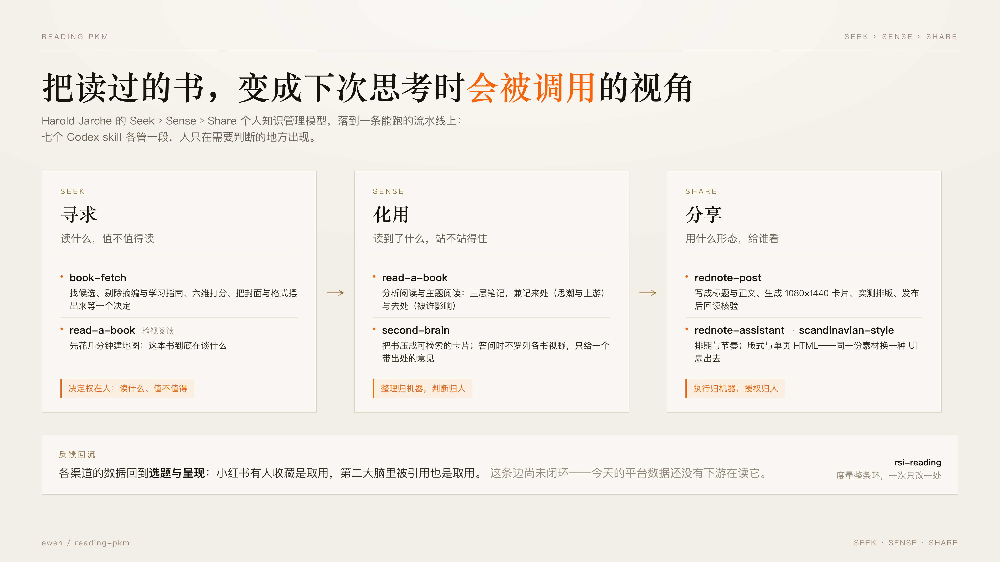
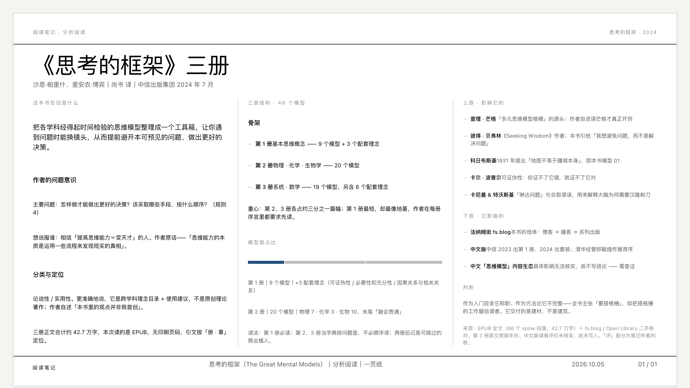
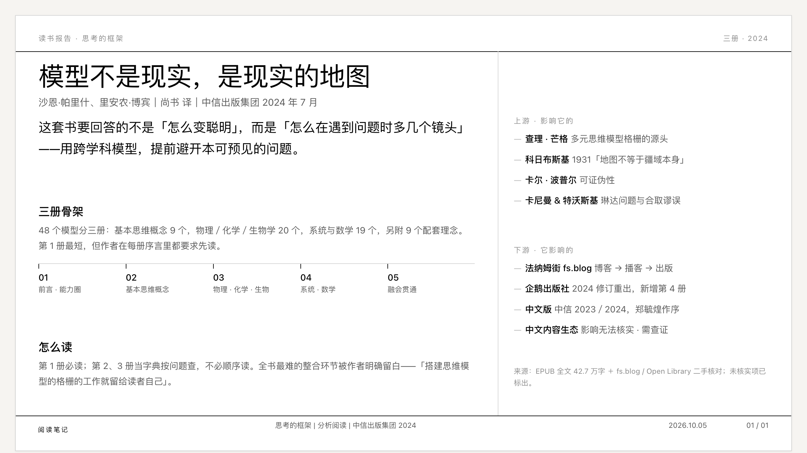
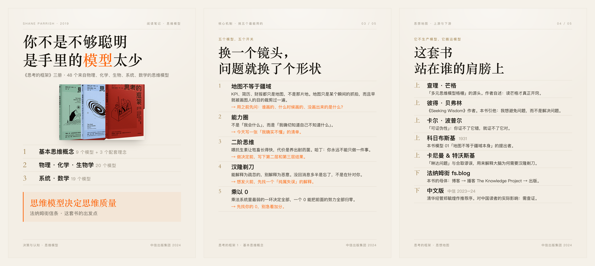
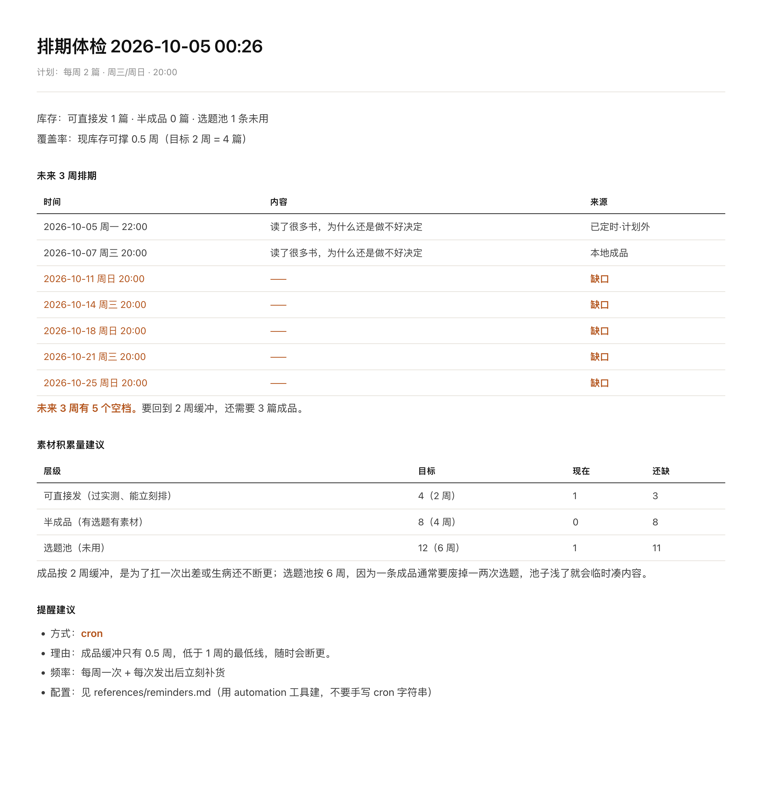
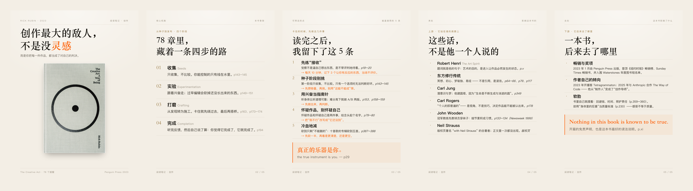

# reading-pkm

> 把读过的书，变成下次思考时**会被调用**的视角。

一条个人阅读的知识管理流水线，由七个 [Codex](https://developers.openai.com/codex/) skill 拼成。
它把 Harold Jarche 的 **Seek › Sense › Share** 模型落成能跑的东西：能被自动化的交给机器，
不能被自动化的——判断与品味——留在人这里。



## 框架：Seek › Sense › Share

Harold Jarche 在 2014 年的 [Sense-making and sharing](https://jarche.com/2014/07/sense-making-and-sharing/)
里，把个人知识管理（PKM）压成三个动作：**seek**（持续找新知识、找不同的人）、**sense**（把它变成
自己的）、**share**（还给网络）。他真正想说的不是这三个词，而是**失衡的代价**：

| 只做其中一件 | 会怎样 |
| --- | --- |
| 只 Seek | 信息过眼不过脑，自己的成长不会发生 |
| 只 Sense | 你不会成为任何知识网络里的节点，错过和他人一起学 |
| 只 Share | 制造噪音，别人开始忽略你 |
| 三件都做，且平衡 | 这才叫 PKM |

平衡没有标准答案，Jarche 的原话是 *each person must find his or her own way*。他还说，
PKM 最难的部分是找到一个**能长期坚持的 sense-making 习惯**；他自己选的是写博客，理由很实在——
博客是自己的，**所有权让人坚持得下去**。

这个仓库是 Ewen 的答案。

## AI 把哪一段变便宜了

AI 对这条链的冲击是不均匀的：

- **Sense 变便宜了。** 三层笔记、脉络梳理、卡片化、带出处地答问——过去要一个下午，现在几分钟。
- **Share 变便宜了。** 排版、渲染、发布、回读核验都能自动跑，边际成本接近零。
- **Seek 没有变便宜。** "这本书值不值得我读"，没有任何模型能替你回答。

所以：**当 sense 和 share 的边际成本趋近于零，瓶颈和护城河就都只剩下 Seek。**
这个仓库的分工就是照这句话切的——机器把两端做厚，人守住起点。

一个诚实的补充：这条链**还没有闭环**。各渠道的数据回来了（小红书有阅读与收藏，第二大脑有被
引用），但还没有任何下游在读它，选题与呈现仍靠手感。`rsi-reading` 就是用来量这条环、
一次只改一处的。

## 三段各自怎么实现

### SEEK · 寻求 —— 决定权在人

| Skill | 做什么 |
| --- | --- |
| [`book-fetch`](./book-fetch) | 把「我要读某本书」变成「手上有一个能直接做笔记的电子书文件」：检索候选、剔除李鬼（摘编／学习指南）、六维综合评分、解析封面与书目核对，**把格式和封面摆给用户确认之后**才下载，下载完洗掉文件名里的来源后缀并登记进待读队列。书源适配器配置在仓库外——**仓库本身不含任何书源信息**。 |
| [`read-a-book`](./read-a-book) 的检视阅读 | 任何一本书的第一步：几分钟建一张地图，回答"这本书在谈什么、值不值得细读"。 |

这两个 skill 都**不替用户做决定**：`book-fetch` 只把候选和证据摆好，`read-a-book` 一律从检视阅读开始。

### SENSE · 化用 —— 机器整理，人下判断

| Skill | 做什么 | 示例 |
| --- | --- | --- |
| [`read-a-book`](./read-a-book) | 用《如何阅读一本书》(Adler & Van Doren) 的方法执行真实阅读：检视 → 分析 → 主题，每本书都梳理来龙去脉（写作目的、所属思潮、影响它的与它影响的），产出结构化笔记；可按需压成**一页纸（one-pager）**。 |  |
| [`second-brain`](./second-brain) | 用已经读过的书回答一个具体问题：挑出真正相关的 1–2 本，用它们的思想视角参与思考，每个观点都带出处与作者。**交付的是意见，不是读书报告。** 书库按「index 当注册表、卡片按需加载」组织——一次问答约 3–5K tokens，而不是把整个书库塞进上下文。 | — |
| [`scandinavian-style`](./scandinavian-style) | 斯堪的纳维亚风格的设计系统：16:9 版式网格、字号层级、页脚规范、配色与图表规则，附可直接改的单页 HTML 模板，以及**密集单页（one-pager）**三栏模式与实测校验脚本。不带任何品牌资产。 |  |

书库里现在有 **17 本书**的笔记与卡片。

### SHARE · 分享 —— 同一份素材，多种 UI

Jarche 提醒 share 要讲分寸：**知道什么时候、对谁分享**，才能建立信任、保持好的信噪比。
技术上的对应是把「内容」「载体」「渠道」拆开——小红书只是其中一种 UI 与渠道，不是终点。

| Skill | 做什么 | 示例 |
| --- | --- | --- |
| [`rednote-post`](./rednote-post) | 把一份素材做成小红书图文笔记并发到自己的账号：写标题与正文、生成 1080×1440 卡片图、**实测**排版（字号下限／溢出／压页脚／孤字换行）、经用户确认后用浏览器桥接发布并回读核验。含卡片模板、渲染校验脚本与发布 CLI。 |  |
| [`rednote-assistant`](./rednote-assistant) | 小红书发布排期助理：定更新频率与发布时段、看平台上有没有未来定时发布的笔记、盘草稿箱、算现有成品能撑几周、指出排期缺口、按账号自己的历史数据挑最佳发布时间。**只排期，不写不发**——文案与发布走 `rednote-post`。 |  |

### 之上的一层

| Skill | 做什么 |
| --- | --- |
| [`rsi-reading`](./rsi-reading) | 把「读书」这条链当成闭环做递归自我改进：度量 read-a-book → 沉淀 → 渲染与分发 → second-brain 取用 的流水线，找断点、给改进项排优先级、跑一次只改一个变量的最小试验并记账。分发按「内容模型／载体／渠道」三层拆开——**小红书只是其中一种 UI 与渠道**。附只读观测仪（`rsi.py`）与三份活文档。**它不读书、不写笔记、不发帖**——改的是流程本身。 |

## 留在 Ewen 的那一步：读书的审美

三段里只有 Seek 是 100% 留给人做的。原因不是技术不够，而是**这一段的判断本质上是审美，不是检索**。

Adler 在《如何阅读一本书》里给过一个不含糊的比例：99% 的书只提供娱乐或资讯，扫描即可；值得完整做
一次分析阅读的书极少；值得反复重读的不到一百本。**这个比例判断不是检索问题。** 相关性排序只回答
"这本书和这个词有多近"，不回答"值不值得我花掉这两天"。

审美的来源是**代价**。一本书值不值得，取决于你为它放弃了什么。AI 读得快，但它不为放弃付代价，
所以它天生排序的是信息量与相关性，而不是值不值得。它能做的，是把候选、评分、封面、格式整整齐齐
摆到你面前（`book-fetch` 干的正是这件事），然后**停在那里，等一个它给不出的决定**。

审美也是靠**读坏的**练出来的。你读过足够多不值得的书，才知道什么值得——这个过程不能代理，
就像你不能靠别人替你健身来获得肌肉。

具体到这条流水线，"读书的审美"至少落在三个地方：

| 品味 | 体现在哪 | 对应到哪个 skill |
| --- | --- | --- |
| **选书的品味** | 什么值得读 | `book-fetch` 的六维评分只是铺路的证据，决定由人下 |
| **判断的品味** | 这本书说得对不对、我信不信 | `read-a-book` 把「评·判断」单列一层，逼出一个立场而不是复述 |
| **表达的克制** | 一本书只留一句话时，留哪句 | 这决定了 Share 段的选题标准：给每本书找一句能被记住的话（"创作最大的敌人，不是没灵感"），而不是写摘要 |

这也是仓库叫 reading-pkm 而不是"读书自动化"的原因：**能被自动化的部分越多，越要清楚哪一部分不能自动化。**
说得再直白一点——AI 可以替你 sense，也可以替你 share，但它不能替你**在意**。

## 分享：小红书上的样子

Share 段目前只有一条渠道跑通：小红书，账号 **司马读书**（[主页](https://www.xiaohongshu.com/user/profile/61fabcd80000000010008da7)）。
截至 2026-10-07，共 262 条笔记、2405 粉丝、2.2 万获赞与收藏。


其中 15 篇是这条流水线的成品——每本书先做分析阅读，压成卡片，再渲染成 5 张 1080×1440 的图文。
同一批模板跑出来的封面，题材不同、版式不变：


一篇笔记的完整五张卡（Rick Rubin《The Creative Act》），从封面到"来处／去处"：



## 仓库结构

```
read-a-book/          阅读方法论：检视 / 分析 / 主题阅读
second-brain/         书库：17 本书的卡片与笔记，按需加载
book-fetch/           SEEK：取得书
scandinavian-style/   版式系统：16:9 网格、one-pager、图表规则
rednote-post/         SHARE：渲染成卡片并发布
rednote-assistant/    SHARE：排期与节奏
rsi-reading/          站在上面那层：度量整条环，一次只改一处
docs/                 README 用图与其生成脚本
```

## 安装

把 skill 目录复制到 Codex 的 skills 目录：

```bash
for s in book-fetch read-a-book second-brain scandinavian-style \
         rednote-post rednote-assistant rsi-reading; do
  cp -R "$s" "${CODEX_HOME:-$HOME/.codex}/skills/"
done
```

开发时直接软链，改仓库即生效：

```bash
for s in book-fetch read-a-book second-brain scandinavian-style \
         rednote-post rednote-assistant rsi-reading; do
  ln -sfn "$PWD/$s" "${CODEX_HOME:-$HOME/.codex}/skills/$s"
done
```

两个 skill 需要额外配置，配置都在仓库外——**仓库里不含任何凭据或书源信息**：

- `book-fetch`：书源适配器，见 [`book-fetch/SKILL.md`](./book-fetch/SKILL.md)
- `rednote-post`：浏览器桥接与扩展，见 [`rednote-post/references/publishing.md`](./rednote-post/references/publishing.md)

---

配图都是可复现的：框架图源文件在 [`docs/src/framework.html`](./docs/src/framework.html)，
主页与卡片拼图由 `python3 docs/src/build_images.py` 生成。
